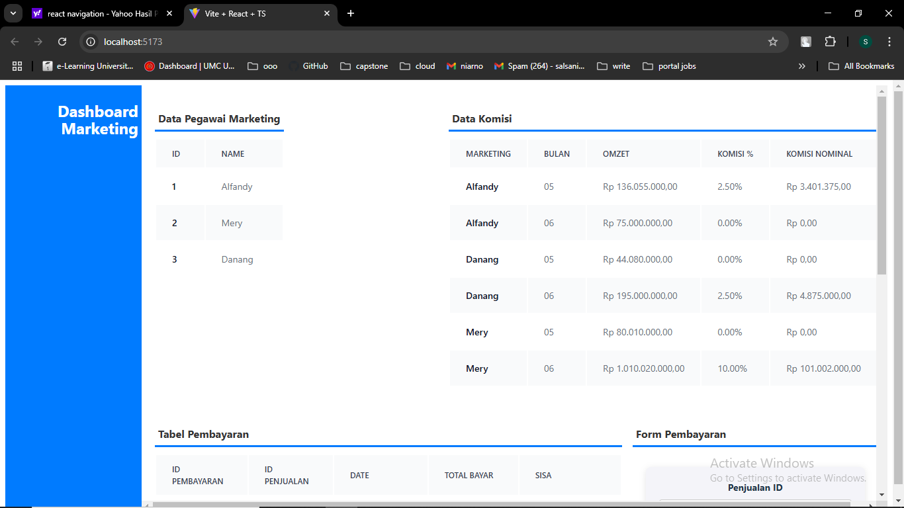
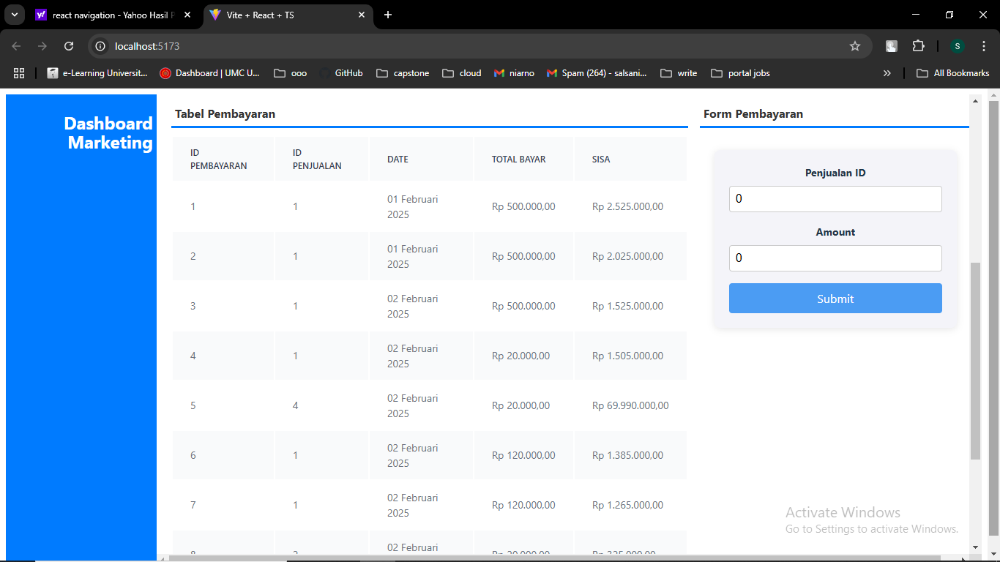
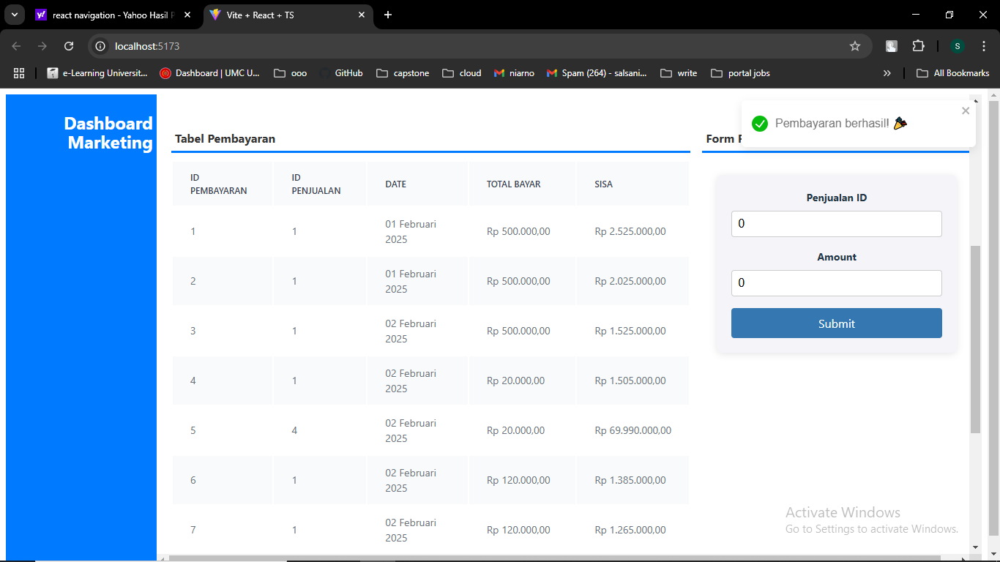

# Herca Test

This project is a web application built with **Go** for the backend and **React** for the frontend. It uses **PostgreSQL** as the database.

## Getting Started

Follow these instructions to set up and run both the **backend** and **frontend** of the application.

### 1. Prerequisites

Before you begin, make sure you have the following installed on your machine:

- **Go**: Download and install Go from [https://golang.org/dl/](https://golang.org/dl/).
- **Node.js & npm**: Download and install Node.js from [https://nodejs.org/en/](https://nodejs.org/en/).
- **PostgreSQL**: Download and install PostgreSQL from [https://www.postgresql.org/download/](https://www.postgresql.org/download/).

### 2. Set Up the Backend (Go)

#### 2.1 Clone the repository

Clone the project repository to your local machine:

```bash
git clone <your-repository-url>
cd <your-project-directory>
```

### APP Screenshoot




